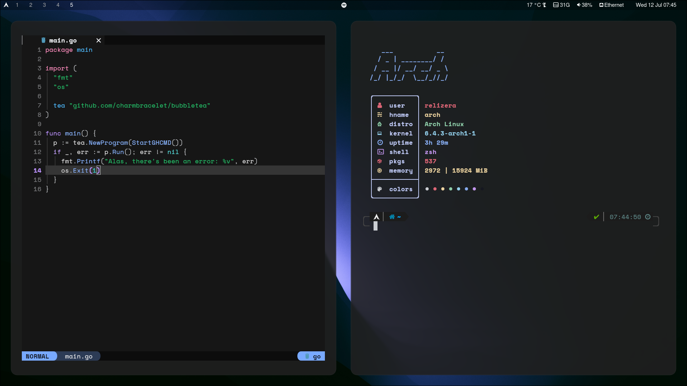

## dotfiles

- **Window Manager:** <a href="https://github.com/hyprwm/Hyprland">Hyprland</a>
- **Shell:** <a href="https://github.com/ohmyzsh/ohmyzsh">Oh My Zsh</a>
- **Terminal:** <a href="https://github.com/kovidgoyal/kitty">kitty</a>
- **Status Bar:** <a href="https://github.com/Alexays/Waybar">Waybar</a>
- **Notify Daemon:** <a href="https://github.com/dunst-project/dunst">Dunst</a>
- **App Launcher:** <a href="https://github.com/lbonn/rofi#wayland-support">Rofi Wayland</a>

 

